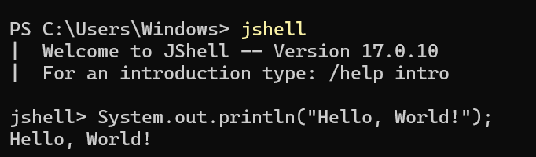

# JShell and REPL

## Introduction

JShell is an interactive command-line tool introduced in **JDK 9**. It allows us to write and execute Java statements without creating a complete Java program.

JShell follows the **REPL** (Read-Evaluate-Print-Loop) model.

---

## What is REPL?

**REPL** stands for:

- **R** - Read
- **E** - Evaluate
- **P** - Print
- **L** - Loop

---

## How REPL Works

### 1. Read

JShell reads the Java statement entered by the user.

Example:

```java
System.out.println("Hello");
```

---

### 2. Evaluate

JShell checks the syntax and executes the statement.

---

### 3. Print

The output is displayed.

```
Hello
```

---

### 4. Loop

After displaying the output, JShell waits for the next input and repeats the same process.

---

## Why don't we write `public class` and `main()`?

In a normal Java program, we write:

```java
public class Demo {

    public static void main(String[] args) {
        System.out.println("Hello");
    }

}
```

In JShell, we simply write:

```java
System.out.println("Hello");
```

JShell internally manages the required program structure, so we don't need to write `public class` or `main()`.

---

## Can We Write Java Programs in JShell?

Yes.

We can write:

- Variables
- Operators
- Loops
- Conditional Statements
- Methods
- Classes
- Objects
- Arrays
- Collections
- Exception Handling
- User Input using `Scanner`

Example:

```java
import java.util.Scanner;

Scanner sc = new Scanner(System.in);

int n = sc.nextInt();

System.out.println(n);
```

---

## Where Does JShell Store the Code?

JShell does **not** create a `.java` file automatically.

The code is stored **temporarily in memory** during the current JShell session.

Example:

```java
class Student {

}
```

The `Student` class can be used anywhere in the same JShell session.

```java
Student s = new Student();
```

If the JShell session is closed, the code is lost unless it is explicitly saved.

---

## JShell vs Normal Java Program

| JShell | Normal Java Program |
|---------|---------------------|
| Interactive execution | Complete Java application |
| No `public class` required | `public class` and `main()` are usually required |
| Temporary session | Saved as `.java` files |
| Used for learning and testing | Used for developing applications |

---

## Advantages of JShell

- Executes code immediately.
- No need to write a complete Java program.
- Useful for learning Java.
- Ideal for testing small pieces of code.
- Helpful for debugging.

---
## Example

### Code

```java
System.out.println("Hello, World!");
```

### Output

<p align="center">
  
</p>

## Key Points

- JShell is an interactive Java shell introduced in JDK 9.
- It follows the REPL (Read-Evaluate-Print-Loop) model.
- No need to write `public class` or `main()` in JShell.
- JShell internally manages the required program structure.
- Code is stored temporarily in memory.
- JShell is mainly used for learning, testing, and debugging.
- Large applications are developed using normal Java source files.

---

## Interview Questions

### 1. What is JShell?

JShell is an interactive command-line tool that allows developers to execute Java code without writing a complete Java program.

---

### 2. What does REPL stand for?

Read, Evaluate, Print, and Loop.

---

### 3. Which JDK version introduced JShell?

JDK 9.

---

### 4. Why is `main()` not required in JShell?

Because JShell internally manages the required program structure and executes the entered statements directly.

---

### 5. Where does JShell store the code?

JShell stores code temporarily in memory during the current session. It does not automatically create `.java` files.

---

### 6. Can we use `Scanner` in JShell?

Yes. JShell supports `Scanner` and most Java features.

---

### 7. Is JShell used for developing large applications?

No. JShell is mainly used for learning, testing, and debugging. Large applications are developed using normal Java source files.